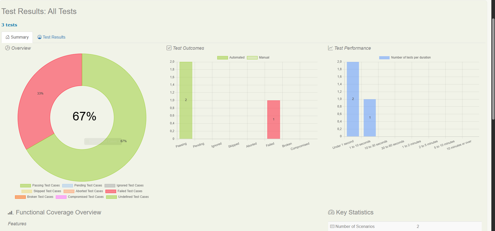

# Pet Store API Testing Project

This project contains automated functional and load tests for the Swagger Pet Store API. I developed as part of a technical challenge for Visa.

## Functional Tests

Functional testing was implemented using BDD with Serenity and Cucumber. The goal was to validate the API backend in a real world alike scenario showing my previous experience.

### User Management Tests

Some of the tests I design and implemented verifying user,pet,orders lifecycle operations including:

* Users/pets creation
* Users/pets deletion
* User login validation
* Test invalid order operations
* Validate error messages and response codes

Reports of the tested features can be found in `petstore-testing-suite/saved_reports`. 

Screenshosts of the porject can be found in `petstore-testing-suite/saved_reports/screenshots`.

The reports look like this: 




## Load Tests

I also created a series of JMeter tests simulating traffic to different API endpoints.

JMeter is the tool I have experience with, so I apologize for not using the technology stack proposed. However, the concepts behind load and stress testing are the same, so I should have no problem ramping up with the actual tool used in the project.

The structure of the project is the following, those include GET endpoints that were stress tested; also POST and PUT were included with CSV-driven payloads to demonstrate JMeter parameterization capabilities.


### Prerequisites

* Java 18
* Maven
* JMeter (for load testing)

### Running Functional Tests

```bash
mvn clean verify
```

### Running Load Tests

```bash
jmeter -n -t "load_tests/load_tests.jmx" -l results.jtl
```

### Test Reports

Serenity BDD generates rich HTML reports after functional tests, available in:

```
target/site/serenity/index.html
```


# Pet Store API Tested Results Report
Some issues were identified after running the designed tests that impact the API's reliability and security.
## Functional Test Results
### Issues Identified
1. **Data Validation Issues**

    - After placing an order with invalid data in `store_error_handling.feature`, POST call on `/store/order` accepts null values for required fields when placing orders. 
      Check `store_error_handling_failure.zip` for details.

2. **Updating Issues**
    - After updating a status of a pet, `pet_status_update.feature` scenarios sometimes fails when retrieven the updated field indicating a delay in the GET responses after PUT operations in `/pet` endpoint.
      Check `pet-status-update-feature-report.zip` for details.

3. **Intermittent Failures**
    - In `store_crud_operations.feature` Order deletion shows inconsistent behavior using DELETE call on `/store/order/`
    - Sometimes orders are deleted successfully, other times "order not found" error occurs. Check `store_crud_operations_failure.zip` for details.
   
4. **Pet Creation Inconsistencies**
    - Pet creation endpoints show unpredictable success rates. Check `pet_creation_failure.zip` and  `pet_creation_success.zip` for details.
      
5. **Authentication Problems**
    - Any user can authenticate regardless of credentials
    - GET, PUT, and POST operations proceed without proper authorization.


# Performance Testing Summary

This test was conducted solely for the sake of the challlenge. The Swagger Petstore is public API and I don't want to subject it to excessive load.

### Test: `petstore-pet-GET-load-100x1000`

This test simulates 100 virtual users, each performing 1,000 GET requests to the `/v2/pet/findByStatus` endpoint of the Swagger Petstore API. However, due to environmental constraints and to avoid overloading the public API, only 12,591 samples were executed in this run.

### Key Metrics Obtained

| Metric             | Value                |
| ------------------ | -------------------- |
| Number of Samples  | 12,591               |
| Average Time       | 7348 ms              |
| Minimum / Maximum  | 24 ms / 22958 ms     |
| Standard Deviation | 3823 ms              |
| Error Percentage   | 0.802%               |
| Throughput         | \~709.5 requests/sec |
| Received KB/sec    | 2080.88              |
| Sent KB/sec        | 0.06                 |

**conclusion:** The high average response times and large deviation indicate potential performance issues under load behavior from the server.

## Notes for the reviwer

* In previous expirence scenarios, load and stress testing are conducted under client-approved conditions with traffic volumes defined by acceptance criteria.

* Load and stress tests should ideally be conducted during off-peak hours or in maintenance windows.

* The other POST and PUT request tests in the JMeter file were not subjected to heavy load. They were created to illustrate how to use JMeter with payloads sourced from CSV files as I did in previus jobs.

Besides the Summary Report (CSV), some of the JMeter reports that aid in performance analysis are:

* View Results Tree
    
* Graph Results
    
* Aggregate Report
    

### TODO (Personal Notes for future me)
* Refactor functional tests to fully adopt the Screenplay Pattern.

* Create Jenkins CI/CD pipelines to:

  * Automate test execution

  * Parameterize build configurations

  * Archive and publish test reports

* Implement performance assertions in JMeter to enable lightweight performance smoke tests.
